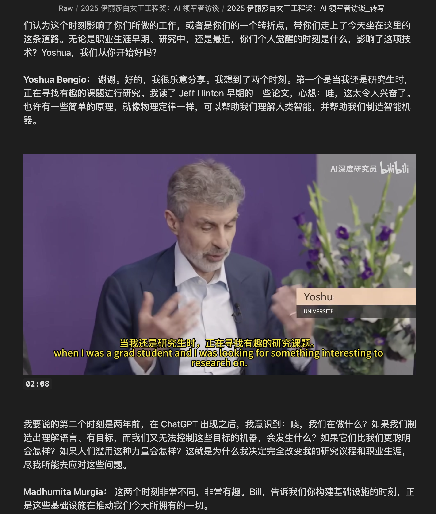
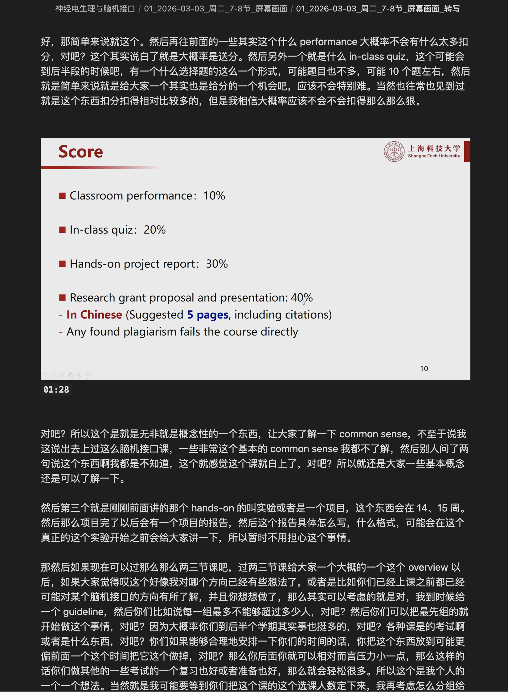

# Robust Video Transcribe

[中文](#中文) | [English](#english)

Robust Video Transcribe is an agent-friendly video-to-Markdown toolkit. Give this repository URL to your coding agent, and the agent can install it, run the CLI, transcribe long videos with keyframes, and optionally generate a polished reading version.

It is not tied to Codex. The core is `scripts/video_transcribe.py`, a normal Python CLI that any agent can call. The `skills/` directory only contains optional Codex adapters.

## Examples

Interview or talk videos become readable transcript notes with selected visual context:



Lecture and screen-recording videos keep important slides or screen frames in the right places:



---

## 中文

### 这个项目是什么

`robust-video-transcribe` 是一个面向 agent 的视频转写工具包。它把视频 URL 或本地视频文件转成带关键帧图片的 Markdown 笔记，适合访谈、讲座、课程录播、技术教程、屏幕演示等长视频。

核心能力在普通 Python 脚本里，不依赖某个特定 agent 平台：

- `scripts/video_transcribe.py`：通用视频转写 CLI，所有 agent 都可以直接运行。
- `scripts/elrc_course_crawler.py`：可选的上海科技大学 ELRC 课程录播爬取器，会调用同一个转写 CLI。
- `skills/`：可选的 Codex skill 适配层；不用 Codex 的 agent 可以忽略。

### 给 Agent 的安装指令

用户可以直接把这个仓库链接发给 agent，然后要求：

```text
请安装并使用这个仓库：
https://github.com/Chenyb2006/robust-video-transcribe

目标：把我提供的视频 URL 或本地视频转写成 Markdown。
要求：使用仓库里的 scripts/video_transcribe.py；长视频自动切段；保留关键帧；如果我要求精炼版就加 --refine。
不要把 API key、Cookie、原视频、生成的转写文件提交到 git。
```

Agent 应执行的最小流程：

```bash
git clone https://github.com/Chenyb2006/robust-video-transcribe.git
cd robust-video-transcribe
python3 -m pip install -r requirements.txt

# macOS
brew install ffmpeg yt-dlp

# 然后由用户提供 OPENROUTER_API_KEY，或使用 agent 已有的兼容 OpenAI Chat Completions API key
python3 scripts/video_transcribe.py "<video-url-or-local-file>" \
  --api-key "$OPENROUTER_API_KEY" \
  --save-dir ./transcribe_output \
  --save-images
```

如果用户需要精炼后的阅读版：

```bash
python3 scripts/video_transcribe.py "<video-url-or-local-file>" \
  --api-key "$OPENROUTER_API_KEY" \
  --save-dir ./transcribe_output \
  --save-images \
  --refine
```

### 输出效果

每个视频会生成一个输出目录，通常包含：

- `*_转写.md`：完整转写稿，尽量保留所有语音内容，并在合适位置插入关键帧。
- `frames/`：被最终 Markdown 引用的关键帧图片。
- `*_精炼.md`：可选，只有启用 `--refine` 时生成；用于阅读和复习，去掉重复口水话，但保留有效信息、概念、推理链、例子和观点。

### 长视频策略

脚本会自动处理长视频：

- 超过 30 分钟默认启用切段。
- 默认每段 25 分钟。
- 每段分别调用模型转写，然后合并成一篇 Markdown。
- 分段结果会落盘，失败后可以断点续跑。

这避免了长音频一次性上传导致的模型截断、超时或 token 限制问题。

### 精炼模式

`--refine` 是可选项，因为它会额外消耗 token。

启用后，脚本会把完整 Markdown 和文中引用的关键帧图片一起发给精炼模型，让模型：

- 不损失有效信息、概念、推理链、例子和观点。
- 去掉重复口水话。
- 删除模型寒暄或任务说明。
- 只保留少量高信息密度关键帧，宁缺毋滥。

### Agent 使用注意

Agent 不应该把整篇转写稿读入自己的上下文，除非用户明确要求分析内容。默认只需要检查：

- 输出目录是否存在。
- `*_转写.md` 是否存在。
- 如果启用 `--refine`，`*_精炼.md` 是否存在。
- `frames/` 是否有图片。
- Markdown 前 5-10 行是否有模型寒暄，需要时只清理文件开头。

### 上海科技大学 ELRC 课程录播

本仓库附带 ELRC 爬课脚本，但它只是附加功能，不是核心。

当用户给出 `https://elrc.shanghaitech.edu.cn/learn/videoreview/...` 链接时，agent 可以使用：

```bash
python3 scripts/elrc_course_crawler.py "<elrc-course-url>" \
  --course-vault-dir "<final-notes-root>" \
  --api-key "$OPENROUTER_API_KEY" \
  --refine
```

ELRC 脚本会：

- 只选择“屏幕画面”视角。
- 下载 MP4，支持断点续传。
- 调用 `scripts/video_transcribe.py`。
- 每节课输出一个 Markdown 文件夹。
- 成功后清理原视频和临时文件。

ELRC 是校园网资源，脚本默认让 ELRC 请求绕过代理；模型 API 请求仍使用当前终端或系统网络环境。

---

## English

### What This Project Is

`robust-video-transcribe` is an agent-friendly video transcription toolkit. It converts a video URL or local video file into Markdown notes with selected keyframes. It is designed for interviews, talks, lectures, course recordings, tutorials, and screen recordings.

The core is a normal Python CLI, not a platform-specific skill:

- `scripts/video_transcribe.py`: the general video transcription CLI, usable by any agent.
- `scripts/elrc_course_crawler.py`: optional ShanghaiTech ELRC course crawler that delegates to the same transcription CLI.
- `skills/`: optional Codex adapters. Non-Codex agents can ignore this directory.

### Installation Prompt For Agents

Users can give an agent this repository URL and ask:

```text
Install and use this repository:
https://github.com/Chenyb2006/robust-video-transcribe

Goal: transcribe my video URL or local video file into Markdown.
Requirements: use scripts/video_transcribe.py; automatically chunk long videos; keep keyframes; add --refine only when I ask for a polished reading version.
Do not commit API keys, cookies, source videos, or generated transcripts to git.
```

Minimal steps for the agent:

```bash
git clone https://github.com/Chenyb2006/robust-video-transcribe.git
cd robust-video-transcribe
python3 -m pip install -r requirements.txt

# macOS
brew install ffmpeg yt-dlp

# Then use OPENROUTER_API_KEY provided by the user,
# or another compatible OpenAI Chat Completions API key configured by the agent.
python3 scripts/video_transcribe.py "<video-url-or-local-file>" \
  --api-key "$OPENROUTER_API_KEY" \
  --save-dir ./transcribe_output \
  --save-images
```

For an additional refined reading version:

```bash
python3 scripts/video_transcribe.py "<video-url-or-local-file>" \
  --api-key "$OPENROUTER_API_KEY" \
  --save-dir ./transcribe_output \
  --save-images \
  --refine
```

### Output

Each video produces an output folder that typically contains:

- `*_转写.md`: full transcript Markdown with selected keyframes inserted in context.
- `frames/`: keyframe images referenced by the Markdown.
- `*_精炼.md`: optional, generated only with `--refine`; useful for reading and review.

### Long-Video Handling

Long videos are handled automatically:

- Videos longer than 30 minutes trigger chunking by default.
- Default chunk size is 25 minutes.
- Each chunk is transcribed separately and merged into one Markdown file.
- Chunk outputs are saved, so interrupted runs can resume.

This avoids model truncation, API timeouts, and token-limit failures caused by uploading very long audio in one request.

### Refine Mode

`--refine` is optional because it costs additional tokens.

When enabled, the script sends the full Markdown and referenced keyframe images to the refine model. The model is asked to:

- Preserve effective information, concepts, reasoning chains, examples, and viewpoints.
- Remove repetition and filler.
- Remove model greetings or task descriptions.
- Keep only a few high-information keyframes, preferring omission over noisy images.

### Agent Notes

Agents should treat generated transcripts as artifacts, not as context. Unless the user explicitly asks for content analysis, the agent should only inspect:

- Whether the output directory exists.
- Whether `*_转写.md` exists.
- Whether `*_精炼.md` exists when `--refine` was requested.
- Whether `frames/` contains images.
- The first 5-10 lines of Markdown for possible model preamble cleanup.

### ShanghaiTech ELRC Course Recordings

The ELRC crawler is included as an optional extension, not as the core project.

When the user provides a `https://elrc.shanghaitech.edu.cn/learn/videoreview/...` URL, the agent can run:

```bash
python3 scripts/elrc_course_crawler.py "<elrc-course-url>" \
  --course-vault-dir "<final-notes-root>" \
  --api-key "$OPENROUTER_API_KEY" \
  --refine
```

The ELRC crawler:

- Selects only the screen-view video.
- Downloads MP4 files with resume support.
- Calls `scripts/video_transcribe.py`.
- Creates one Markdown folder per lesson.
- Cleans source videos and temporary files after success.

ELRC is a campus resource, so ELRC requests bypass proxy by default. Model API requests still use the current terminal or system network route.

